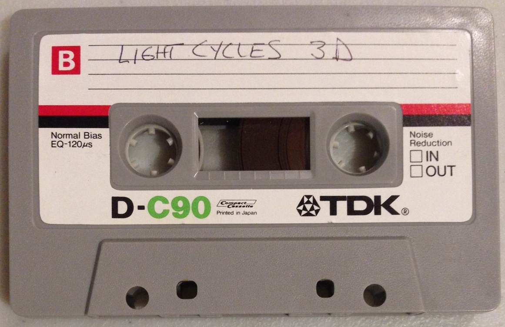

# LightCycles 3D 2017 Preface

Here is an unexpected discovery for the 40th anniversary of the launch of the Apple II - an original game from 1977. You may have thought that Lemonade Stand and Little BrickOut were the titles to show off the capabilities of the Apple II. This, Light Cycles 3D, was the game that was supposed to ship with the computer but was pulled at the last minute for unknown reasons. We discovered the cassette tape, hidden in the archives of the developer.

The binary program  was copied onto a floppy and a simple loader (and updated init screen) was added to show off this gem from a bygone era (available here: https://github.com/dschmenk/LightCycles/raw/master/lightcycles.po). Enjoy what could have been,

The 8-Bit Bunch - April 1, 2017

P.S. If you notice keypresses aren’t being recognized, make sure CAPS LOCK is down - there was only upper case on the original Apple ][.

# Source Code Update!

The original developer has granted permission to post the source code for the game! I've updated the source to be compatible with modern tools for building in current environments - who still has a working PDP-10?

## How to build:

LightCycles is built with the **acme** assembler (available here: http://acme-crossass.sourceforge.net). I use version 0.91. To build the binary, simply type:

    acme -o lightcycles.bin lightcycles.asm

This will create the binary program. To run it, the binary must be inserted into the ProDOS disk image available in this repository. One easy way to do this is with AppleCommander (available here: http://applecommander.sourceforge.net) A command-line Java program that manipulates Apple II disk images. You would insert the binary into the disk image with:

    java -jar AppleCommander.jar -d lightcycles.po lightcycles
    java -jar AppleCommander.jar -p lightcycles.po BIN $1000 lightcycles < lightcycles.bin

You will find some programs in the utils/ directory used to create some of the data tables. The only interesting one is the mapconvert.c program. This will take a 64x64 bitmap image in the very braindead ASCII PBM format and spit out an RLE map suitable for insertion into the game. A few additional parameters need to be set for starting position and angle, then a new map will be available to play. Look in the maps/ directory for the provided in-game maps.
