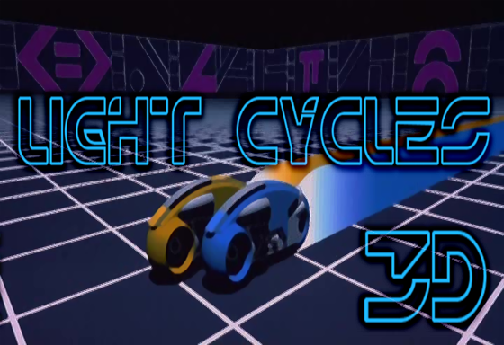

## LightCycles 3D 2017 Preface

Here is an unexpected discovery for the 40th anniversary of the launch of the Apple II - an original game from 1977. You may have thought that Lemonade Stand and Little BrickOut were the titles to show off the capabilities of the Apple II. This, Light Cycles 3D, was the game that was supposed to ship with the computer but was pulled at the last minute for unknown reasons. We discovered the cassette tape, hidden in the archives of the developer.

The binary program  was copied onto a floppy and a simple loader (and updated init screen) was added to show off this gem from a bygone era. What follows is a scan of the original instructions. Enjoy what could have been,

The 8-Bit Bunch - April 1, 2017

P.S. If you notice keypresses aren’t being recognized, make sure CAPS LOCK is down - there was only upper case on the original Apple ][.
